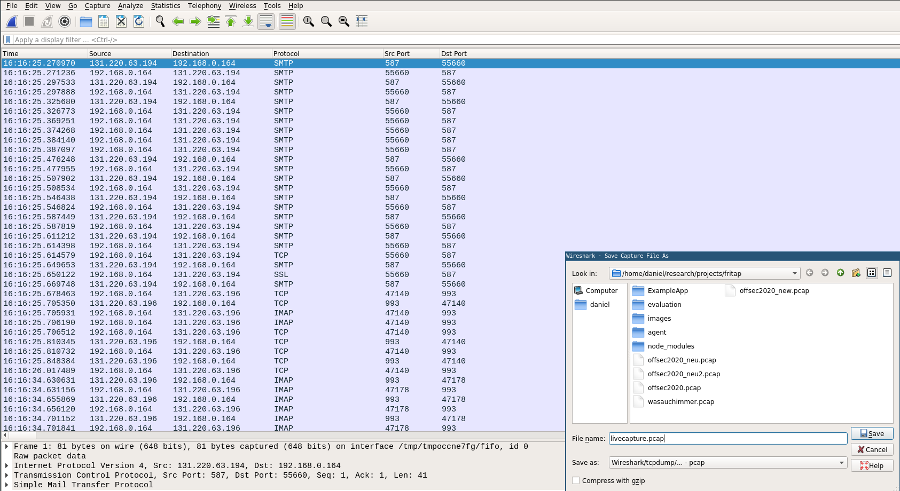

# Usage
Usage: friTap.py [-a] [-k <path>] [-l] [-p  <path>] [-s] [-v] [--enable_spawn_gating] <executable/app name/pid>

Decrypts and logs an executables or android applications SSL/TLS traffic.

Arguments:
  - `-a`, `--android` Attach to a process on android
  - `-k <path>`, `--keylog <path>` Log the keys used for tls traffic
  - `-l`, `--live` Creates a named pipe /tmp/sharkfin which can be read by Wireshark during the capturing process
  - `-p  <path>`, `--pcap <path>` Name of PCAP file to write
  - `-s`, `--spawn` Spawn the executable/app instead of attaching to a running process
  - `-v`, `--verbose` Show verbose output
  - `--enable_spawn_gating` Catch newly spawned processes. ATTENTION: These could be unrelated to the current process!
  - `<executable/app name/pid>` executable/app whose SSL calls to log

The target device needs to have frida-server running when Android or iOS apps are analyzed. Further information about setting up the device can be found [here](https://frida.re/docs/android/).
# Examples
## Spawn an app and show output on screen
`python3 ./fritap.py -a com.example.app --spawn --verbose`

The output could look like this:


## Attach to a running app and write traffic to pcap
`python3 ./fritap.py -a com.example.app -p myLogFile.pcap`

Output:


Note that the packets in this pcap currently only reflect the content, source and destination of packets. Certain IP/TCP header information may be omitted or set to default values. For a more precise output, log the traffic seperately and decrypt it using the keys logged by the `-keylog` option (see example below). 
Also, when you try to analyse the resulting pcap, it might happen that wireshark mistakes the decrypted traffic for still being encoded because it still runs on port 443 (happens e.g. for HTTP2 traffic, Http1.1 seems to work fine). To circumvent this, just tell wireshark to decode traffic on port 443 as HTTP2 traffic (or  any other).

## Log keys of TLS traffic
`python3 ./fritap.py -a -spawn --keylog myKeyLogFile.log com.example.app`

Output:


The script logs the keys used for encryption like described [here](https://developer.mozilla.org/en-US/docs/Mozilla/Projects/NSS/Key_Log_Format) in the given file. If you record the traffic from the app (e.g. with tcpdump) you can use this file to decrypt the traffic with wireshark. For more information, look [here](https://wiki.wireshark.org/TLS#Using_the_.28Pre.29-Master-Secret).

## Live view utilizing named pipes with Wireshark

```bash
$ python3 ./fritap.py -l com.example.app
[*] Created named pipe for Wireshark live view to /tmp/tmp9is_q9_k/fritap_sharkfin
[*] Now open this named pipe with Wireshark in another terminal: sudo wireshark -k -i /tmp/tmp9is_q9_k/fritap_sharkfin
[*] friTap will continue after the named pipe is ready....

```

In another terminal we than open this named pipe with Wireshark:

```bash
$ sudo wireshark -k -i /tmp/tmp9is_q9_k/fritap_sharkfin &
```

Now we can see and analyze all the packets live with Wireshark. As soon as we stop the capturing friTap will exit. For later analysis it is than possible to safe the capture as pcap:

 


**Note:** It is not possible to safe the PCAP and having a live capture directly through friTap. If you want to safe the PCAP just use the capability of Wireshark to do so.
